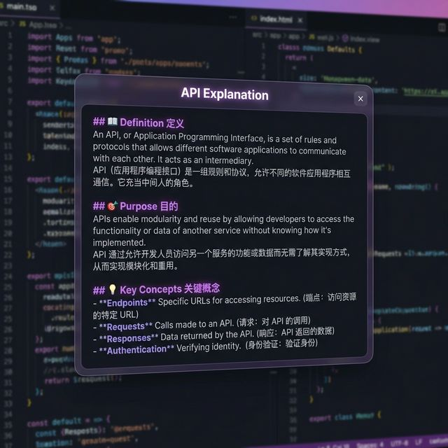

<div align="center">

# ✨ 悬浮词典 — Floating Word Explainer

**划词即解释的 AI 桌面助手**

> 🖱️ 选中文字 → ⌨️ 按下 Shift → 💬 AI 即时解释

[](https://python.org)
[](https://www.riverbankcomputing.com/software/pyqt/)
[](LICENSE)
[](https://www.microsoft.com/windows)

<br>



<br>

*毛玻璃悬浮窗 · 流式 Markdown 渲染 · 上下文感知 · 兼容所有 OpenAI 格式 API*

</div>

---

## 🎬 它是什么？

**悬浮词典**是一个运行在 Windows 桌面的 AI 划词解释工具。无论你在浏览网页、阅读 PDF、还是写代码——只需 **选中文字 + 按 Shift 键**，一个精美的悬浮窗就会在鼠标旁弹出，AI 会结合当前页面的上下文，给出贴合语境的智能解释。

> 💡 就像身边坐着一个博学的朋友，你指哪里，他就帮你解释哪里。

---

## 🌟 核心特性

| 特性 | 描述 |
|:---:|:---|
| 🧊 **毛玻璃悬浮窗** | 圆角半透明窗口，自带呼吸灯动画，可拖动、自动关闭 |
| ⚡ **流式输出** | 逐字打印 AI 回答，像 ChatGPT 一样流畅 |
| 📝 **Markdown 渲染** | 完整支持标题、列表、代码块、加粗等富文本格式 |
| 🧠 **上下文感知** | 自动提取当前页面内容，让 AI 理解你在读什么 |
| 🔌 **兼容多种 API** | 支持 DeepSeek、OpenAI、Ollama 等所有 OpenAI 兼容接口 |
| 🎨 **暗色主题** | 深邃优雅的紫色暗色 UI，久看不累 |
| ⚙️ **可自定义** | API Key、模型、Prompt 模板全部可配置 |
| 📌 **系统托盘** | 安静运行在后台，右键托盘图标管理 |

---

## 🏗️ 架构设计

```
┌─────────────────────────────────────────────────┐
│                  AppController                  │
│            （总指挥 · 协调所有模块）               │
├────────────┬────────────┬───────────┬────────────┤
│            │            │           │            │
│  Hotkey    │  Floating  │   LLM     │   Tray     │
│  Listener  │  Window    │   Client  │   Icon     │
│            │            │           │            │
│ ⌨️ 监听     │ 🪟 悬浮窗   │ 🤖 AI调用  │ 📌 托盘    │
│ Shift键    │ 毛玻璃UI    │ 流式请求   │ 设置/退出  │
│ 提取文本   │ Markdown   │ 逐token   │            │
│ 获取上下文  │ 渲染       │ 推送      │            │
└────────────┴────────────┴───────────┴────────────┘
```

### 📂 项目结构

```
floating_word_explainer/
├── main.py              # 🚀 主入口 & 应用控制器
├── hotkey_listener.py   # ⌨️ 全局热键监听 + 文本/上下文提取
├── floating_window.py   # 🪟 毛玻璃悬浮窗 UI
├── llm_client.py        # 🤖 LLM 流式调用客户端
├── settings_dialog.py   # ⚙️ 设置面板
├── tray_icon.py         # 📌 系统托盘图标
├── toast.py             # 🔔 轻量提示通知
├── config.py            # 💾 配置管理
├── default_config.py    # 📋 默认配置
├── system_prompt.txt    # 📝 AI 系统提示词模板
├── pyproject.toml       # 📦 项目依赖
└── .env                 # 🔑 敏感配置（不提交）
```

---

## 🚀 快速开始

### 1️⃣ 环境要求

- **Python** ≥ 3.13
- **Windows** 10 / 11
- 一个 **OpenAI 兼容 API Key**（推荐 [DeepSeek](https://platform.deepseek.com/)）

### 2️⃣ 安装

```bash
# 克隆项目
git clone https://github.com/FengMaXuub/floating_word_explainer.git
cd floating_word_explainer

# 安装依赖（推荐使用 uv）
uv sync

# 或使用 pip
pip install -e .
```

### 3️⃣ 配置 API Key

首次启动时，右键点击系统托盘图标 → **设置**，填写：

| 配置项 | 说明 | 示例 |
|:---|:---|:---|
| API Key | 你的 AI 服务密钥 | `sk-xxxxxxxx` |
| 接口地址 | API Base URL | `https://api.deepseek.com` |
| 模型名称 | 使用的模型 | `deepseek-chat` |

### 4️⃣ 启动

```bash
python main.py
```

启动后，程序会安静地待在系统托盘 📌

---

## 📖 使用方法

<table>
<tr>
<td width="60">

**步骤 1**
</td>
<td>

🖱️ 在任意应用中 **选中一段文字**
</td>
</tr>
<tr>
<td>

**步骤 2**
</td>
<td>

⌨️ 按下 **Shift** 键
</td>
</tr>
<tr>
<td>

**步骤 3**
</td>
<td>

💬 悬浮窗自动弹出，AI 开始流式输出解释
</td>
</tr>
<tr>
<td>

**步骤 4**
</td>
<td>

❌ 点击关闭按钮、按 Esc、或点击窗口外部即可关闭
</td>
</tr>
</table>

### 🧠 上下文感知是怎么工作的？

悬浮词典不仅仅是"查字典"——它会 **自动读取你当前页面的内容**，让 AI 理解你所在的语境：

```
三层回退策略：
1. 🥇 Windows UI Automation → 直接读取窗口文本
2. 🥈 Ctrl+A 剪贴板回退     → 模拟全选复制（极速，用户无感知）
3. 🥉 窗口标题              → 至少知道你在用什么软件
```

> 同一个词 "class"，在 Python 教程里解释为"类"，在英语课本里解释为"课堂"。
> 这就是上下文感知的魔力 ✨

---

## 🔧 自定义配置

### Prompt 模板

在设置面板中，你可以自定义 AI 的回答风格。使用以下占位符：

| 占位符 | 说明 |
|:---|:---|
| `{text}` | 用户选中的文字 |
| `{context}` | 当前页面上下文 |

**示例 Prompt：**

```
你是翻译专家。请将以下内容翻译成中文，并解释其含义：

上下文：{context}
需要解释的内容：{text}
```

### 兼容的 API 服务

| 服务 | Base URL | 推荐模型 |
|:---|:---|:---|
| DeepSeek | `https://api.deepseek.com` | `deepseek-chat` |
| OpenAI | `https://api.openai.com` | `gpt-4o-mini` |
| Ollama (本地) | `http://localhost:11434` | `qwen2.5` |
| 其他兼容服务 | 自定义 URL | 自定义模型名 |

---

## 🛠️ 技术栈

| 技术 | 用途 |
|:---|:---|
| **PyQt6** | GUI 框架、悬浮窗、系统托盘 |
| **keyboard** | 全局热键监听 |
| **httpx** | 流式 HTTP 请求（调用 LLM API） |
| **pyautogui** | 鼠标位置获取 |
| **pyperclip** | 跨平台剪贴板操作 |
| **markdown** | Markdown → HTML 渲染 |
| **uiautomation** | Windows UI 自动化（上下文提取） |

---

## 🤝 贡献

欢迎提交 Issue 和 Pull Request！

```bash
# Fork 本项目后
git checkout -b feature/your-feature
git commit -m "Add your feature"
git push origin feature/your-feature
# 然后创建 Pull Request
```

---

## 📄 License

[MIT License](LICENSE) © 2026

---

<div align="center">

**如果觉得有用，请给个 ⭐ Star 吧！**

Made with ❤️ and 🤖 AI

</div>
